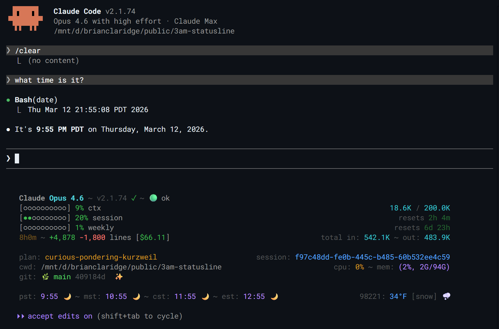

# 3am-statusline

A configurable status bar for [Claude Code](https://docs.anthropic.com/en/docs/claude-code) sessions.



## Install

### As a Claude Code plugin (recommended)

```bash
/plugin marketplace add brianclaridge/3am-statusline
/plugin install 3am-statusline@3am-statusline
```

Then run `/3am-statusline:setup` to detect your platform and wire settings.

### From source

```bash
git clone https://github.com/brianclaridge/3am-statusline.git
cd 3am-statusline
task build
```

Set `statusLine` in `.claude/settings.json` to the built binary path.

## Quick start

Create `config/statusline.yml`:

```yaml
lines:
  - left: "{model.display_name}"
    right: "{cost.total_cost_usd|currency}"
  - left: "{meter:context_window.used_percentage} {context_window.used_percentage|pct} ctx"
    right: "{context_window.total_input_tokens|tokens} tok"

meter:
  width: 10
  filled: "●"
  empty: "○"
```

## Themes

Multiple color themes are supported via the `themes` config section. Set `current_theme` to switch between them, or run `/3am-statusline:theme` to browse and apply themes interactively. A built-in cyberpunk theme is included.

## Documentation

- [Configuration](docs/configuration.md) — config sections, template tokens, format specifiers, available fields, colors, themes
- [Events](docs/events.md) — built-in events (git, time, sys, status, version, weather), custom events

## License

MIT
